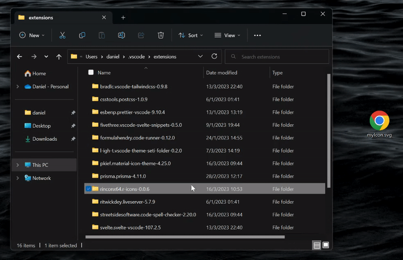
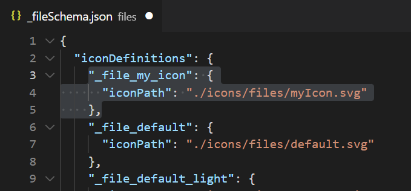
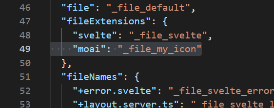
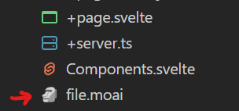

# r-icons

Seti + Folders + SvelteKit

## How to add my own icon?

1. go to: `<USERPROFILE>.vscode\extensions` and look for the r-icons extension
2. then add your icon in the correct folder (`\files` for files icons & `\folders` for your folder icons)

In this example we're adding an file icon:

3. Define & add the icon (you can follow [the vscode extension api](https://code.visualstudio.com/api/extension-guides/file-icon-theme))

 

4. Reload vscode

5. That's it! You can now enjoy your own icons

